# Peekify

<h2 class="h2" align="center" ><i> つなぐ、好奇心。</i></h2>
 

 

<i>隣にいる人は何を聴いているのか、のぞいてみたいと思ったこと、ありませんか？</i>

<i>好奇心で人々をつなぐのが私たちのミッションです。</i>
 

## 何ができるの？

- 他の人が何を聴いているかのぞいてみよう！
- あなた自身が何を聴いていたか履歴が見られます！
- 他の人が聴いていた曲やポッドキャストの履歴ものぞけちゃう！
- 他の人が聴いている曲やポッドキャストにコメントしたり、 :blue_heart:を送れます！
- 他のユーザーをフォローしたり、その人が何を聴いているかわかります！

## サイト

[こちら](https://master.d3koc4k87o35ht.amplifyapp.com/)で使うことができます。

## 使い方

:star: このアプリを使うには、Spotify のアカウントが必要です。

### 1.　 上記のサイトにアクセスして、登録・ログインしてください。

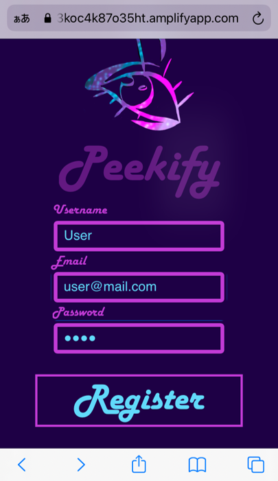
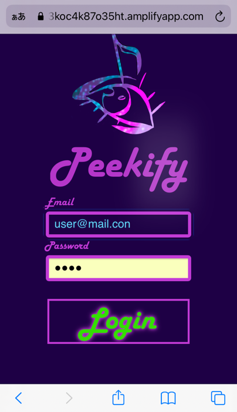

:star:　Peekifyに使うメールアドレスとネームはご自身のSpotifyアカウントと揃える必要はありません。

### 2.　 Spotify と連携させる。

 Login with Spotify とある緑のボタンを押してください。

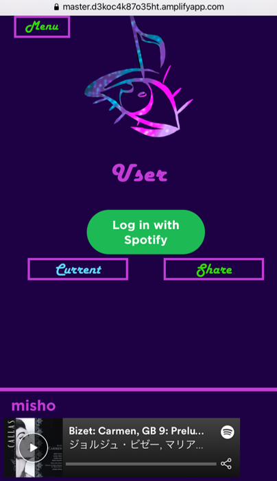

 このアプリを<strong>初めて使うとき</strong>には、こちらのボタンを押すと、Spotifyでログインする画面が表示されます。ログインすると、このアプリとSpotifyを連携させてよいですか？という画面が現れます。（このアプリが利用するSpotifyデータはあなたが今聞いている曲やポッドキャストのID番号です。）よろしければ同意する／OKAYを押してください。

<strong>二回目以降は</strong> 他のユーザーの曲を見るだけなら、 Login with Spotify を押す必要はありません。あなたの聴いている曲やポッドキャストをシェアするためには、この緑ボタンを押してログインする必要があります。（シェアについて詳しくは下のセクション３をご参照ください。）

### 3.　 今聴いている曲やポッドキャストをシェアする。

他のユーザーもあなたが何を聴いているかのぞけますが、それは<strong>あなたがシェアしたものだけ</strong>です。

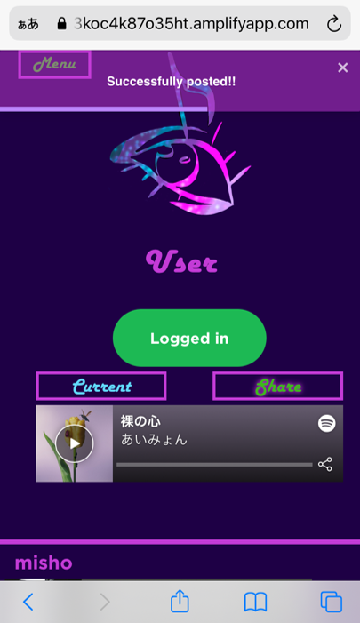

シェアするには、まず Current を押して、今聴いている曲／ポッドキャストを表示させてください。

（Spotifyにログインした時点で再生中の場合はすでに曲／ポッドキャストが表示されています。）  
 Share を押してください。シェアができると"Successfully posted!"と表示されます。

画面下半分の<a href="post-section">ポストセクション</a>は、他のユーザーを表示するセクションで、ここにはあなたがシェアした曲／ポッドキャストは表示されません。

曲／ポッドキャストが変わって、それをシェアしたい！というときには Current を押して表示を更新すればシェアできます。

### 4. 他のユーザーにコメントや:blue_heart:を送る。

画面の下半分は<strong>ポストセクション</strong>です。ここでは下にあるようなことができます。

他のユーザーが聴いている曲やポッドキャストにコメントや:blue_heart:が送れます。

コメントを送るには、薄紫のボックスにコメントを書き、commentを押してください。:blue_heart:を押して送ることもできます。
 

他のユーザーが聴いている曲やポッドキャストもクリックすれば聴けます！

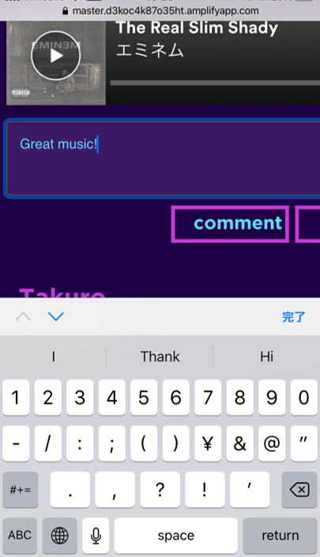

### 5. 他のユーザーの再生履歴をのぞいたり、フォローしたりしよう。

<a href="post-section">ポストセクション</a>では<strong>ユーザー名</strong>を押すと、そのユーザーの再生履歴を表示されます。
 

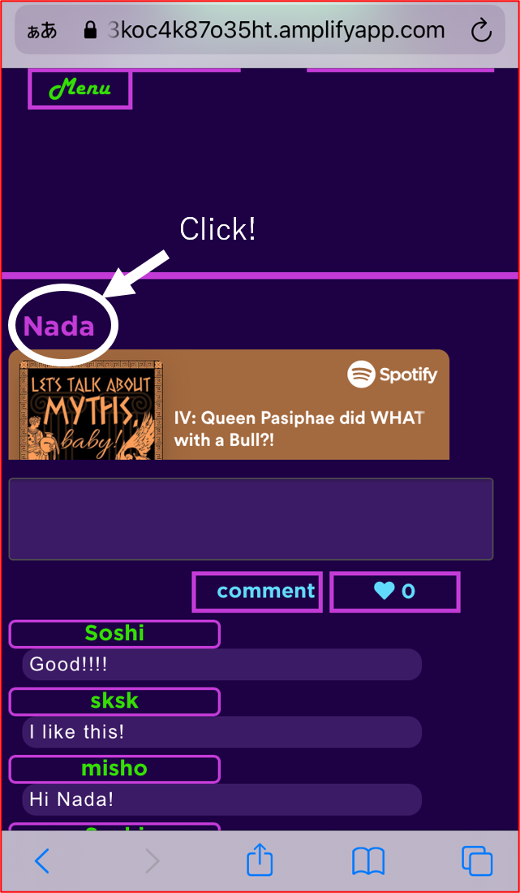

Peekを押せばそのユーザーをフォローできます。フォローをすると文字がPeekからPeekingに変わります。<a href="#peeking-list">Peeking List</a>についてもご覧ください。

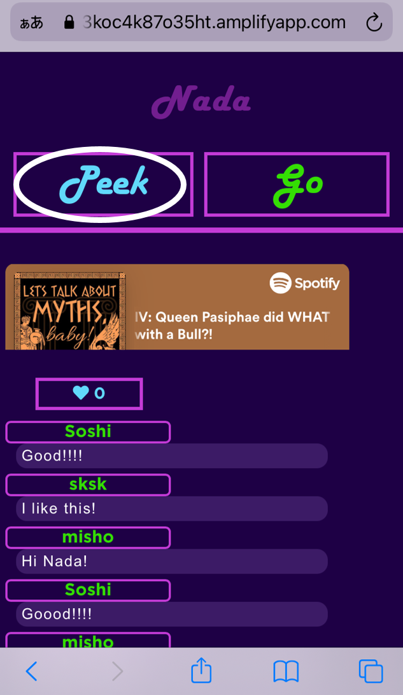

### 6. Menu ボタン

画面左上の Menu を押すと、４つのボタンが現れます。

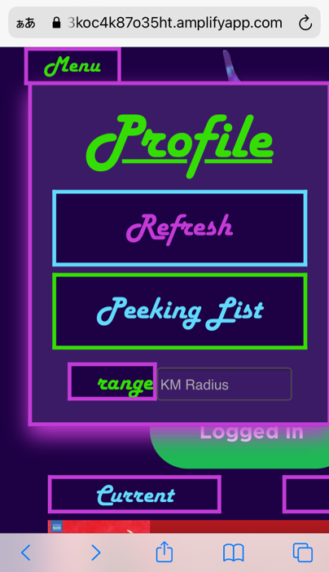

(a)    Profile -- Profileを押すとあなたのprofileページが現れます。ここにはあなたのシェアした再生履歴が、受け取ったコメントや:blue_heart:とともに表示されます。

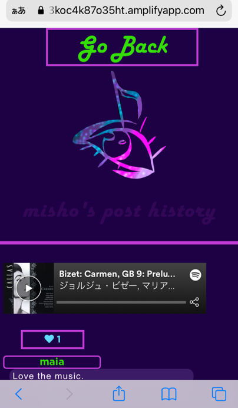
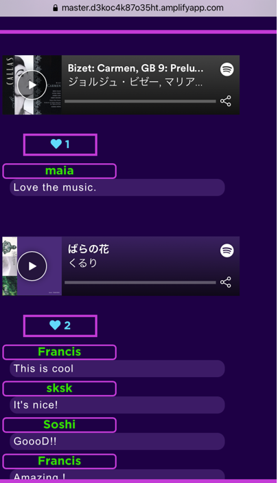

(b) Refresh -- Refreshを押すとアプリ上のデータが最新のものになります。例えば新しい場所に移動したときにこのボタンを押せば、<a href="#post-section">ポストセクション</a>に表示されるユーザーが、今のあなたの位置から近い順番に置き換わります。

(c) Peeking list -- Peeking listを押すとあなたがpeek、つまりフォローしているユーザーだけが<a href="#post-section">ポストセクション</a>に表示されます。

(d)  range と"KM Radius" -- どの範囲のユーザーを<a href="post-section">ポストセクション</a>に表示させるかここで設定できます。例えば、KM Radiusに10と入れ、rangeを押すことで、あなたの今いる場所から半径10キロの範囲にいるユーザーだけを表示できます。

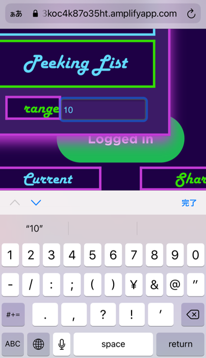

   
## テクノロジー

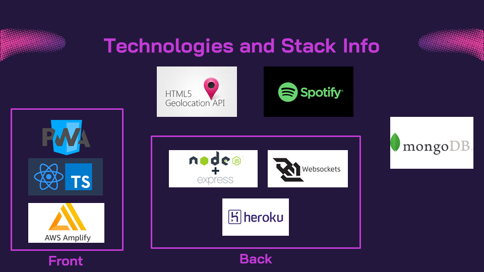

- 
Peekifyはプログレッシブ・ウェブ・アプリケーション（PWA）です。フロントエンドはReactとTypeScriptで書かれ、AWS Amplifyにデプロイされています。

- 
geolocation APIで取得したユーザーの位置、および、Spotify APIで取得した、ユーザーが再生中の曲／ポッドキャストがバックエンドに送られます。

- 
バックエンドでは、ウェブサーバーがNode.jsとExpressで構築され、データベースにはmongoDBを採用しています。ログインとユーザー認証はJWTによって行います。ウェブサーバーはherokuにデプロイしています。

- 
リアルタイムのチャット機能はWebsocketsで実装。Websocketsサーバーはheroku上に、バックエンドとは別個にデプロイされています。

## 今後の機能拡張

1.  ユーザーブロック機能
2.  Peekers peak：地図上でどこに多くのユーザーがいるかを示す。
3.  ポッドキャスト・リスニング・パーティ：他のユーザーと同時に同じポッドキャストを聴いて盛り上がろう！

## プロジェクトのリポジトリ

- フロントエンドは[こちら](https://github.com/CC16-TeamExpresso/front).

- ウェブサーバーは[こちら](https://github.com/CC16-TeamExpresso/back).

- ウェブソケットサーバーは[こちら](https://github.com/CC16-TeamExpresso/websocket).

## 作成者

###  Francis [@Franckgaud](https://github.com/Franckgaud)

###  Misho [@miomaeshima](https://github.com/miomaeshima)

###   Nada [@oneatatimet](https://github.com/oneatatimet)

###   Kaisei [@Kaisei-Suzuki1990](https://github.com/Kaisei-Suzuki1990)

###   Soshi [@SoshiK](https://github.com/SoshiK)

## ライセンス

MIT
