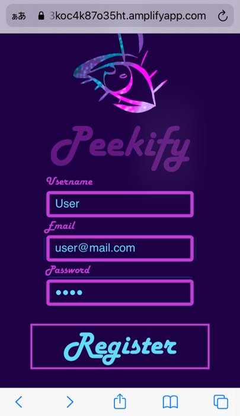
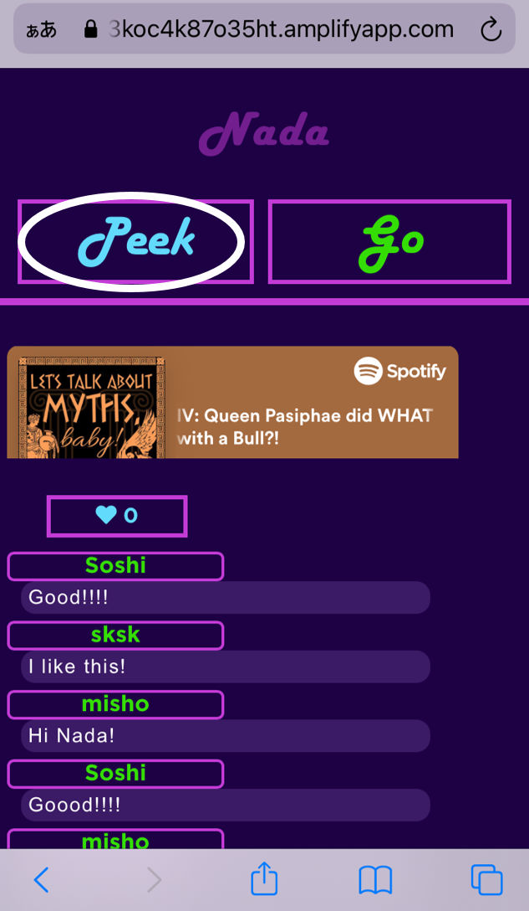
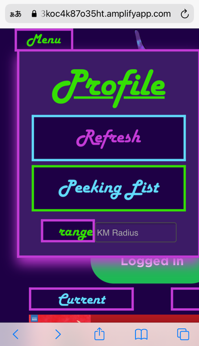
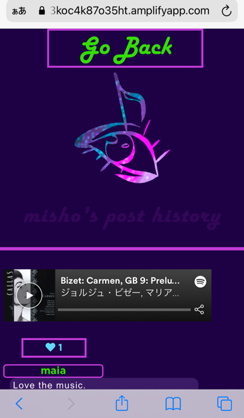
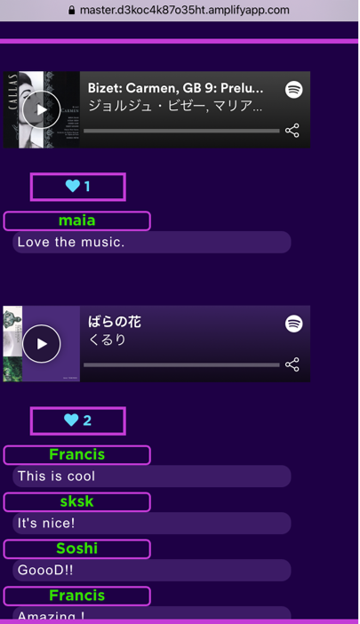
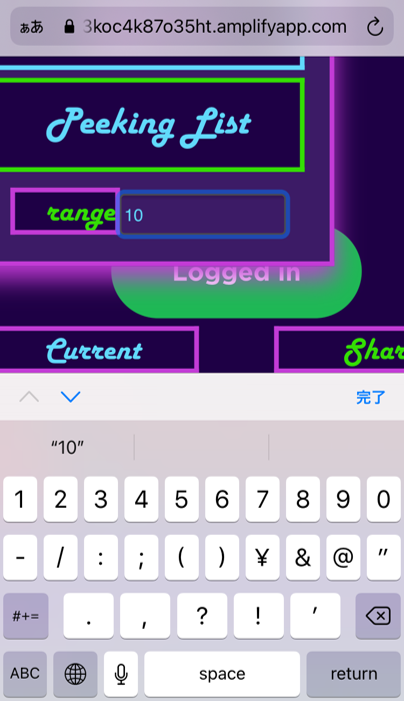

# Peekify

<h2 class="h2" align="center" ><i> Curiosity that connects</i></h2>
 

 

<i>Have you ever wondered what the person next to you is listening to? </i>

<i>Our mission is to connect people through curiosity.</i>
 

## Features

 - You can peek at the music people are playing.:heart:
 - You can check your music history. That is a list of songs you have listened to.
 - You can see other people's music history, too.
 - You can send a brief message and "like" to the music other people are playing.
 - You can follow your favorite users and find what they have been listening to.

## Site
You can use the app [here](https://master.d3koc4k87o35ht.amplifyapp.com/)

## Usage

Prerequisite: You need to have an account with Spotify.

### 1.　Access the site above and register and log in. 

Note: The email and name for Peekify do not need to match those for your Spotify account. 

### 2.　Login with Spotify

Press the green button that says "Login with Spotify."

 When you use this app for <strong> the first time</strong>, you will be asked to log in with Spotify and also if you allow Peekify to receive your Spotify data (what you are listening currently). Press OKAY if you agree to continue.
 

<strong>For the second time onward</strong>, you don't need to press "Log in with Spotify" to see what other users are playing. To share your music with others, however, you need to log in with Spotify. (See section 3 below for more detail.)

### 3.　Share what you are currently playing with other users

Peekify lets other users peek at what you are now playing but <strong>that is possible with the ones that you share.</strong>

To share the music/podcast, first, get the current by pressing "Current."

(You may have the current music/podcast already like in the picture above if you had been playing it on Spotify when you pressed "Log in with Spotify.")  
And press "Share." You see "Successfully posted!" when you shared the music/podcast.

Your music/podcast does not appear on your page. It will appear on other users' screens only.

When you are listening to another music/podcast and want to update the current section, press "Current."

### 4.  Comment and send like to other people

The lower half of the screen is <strong>the post section</strong>. This is where you see what other users are listening to. Here you can do following things.

You can send a comment and like to what other people are listening.

To write a comment, text in the light purple box and press "comment" to send it.
You can also press the heart icon to send a "like".
 

You can also listen to the music/podcast other users are playing.

### 5. Peek other users' playing history and follow them

In <a href="post-section">the post section</a>, click on <i>the name of any user</i> in  to see the history of the music/podcast they shared.
 

Click on "Peek" above the user's history to follow the user. "Peek" will change to "Peeking" for users you follow. See also <a href="#peeking-list">Peeking List"</a>.

### 6. Menu button

If you press the "menu" button at the left top of the screen, you will see four buttons.

(a)   "Profile" -- Press "Profile" to go to your profile page, where you find the list of the music/podcast you shared along with comments and likes other users sent. 

(b) "Refresh" -- Press "Refresh" to refresh data on the app. You can use this button when you have moved to another location. That will reorder other users in <a href="#post-section">the post section</a> according to their closeness to your current location.

(c) "Peeking list" -- Press "Peeking list" to see only the users you are peeking at (i.e. following) in <a href="#post-section">the post section</a>.

(d) "range" and "KM Radius" -- You can narrow down the number of users in <a href="post-section">the post section</a> by setting the range here. For example, entering 10 and pressing "range" would reduce the users to those within the radius of 10 kilometers around you.

 The "range" function works to narrow down the range. If you want to go back to a broader range, hit <a href="refresh">"Refresh"</a> to show the users in the broadest possible coverage and then work from there.

   
## Technolgy used

- 
Peekify is a progressive web application. The frontend is written in React and TypeScript, and is deployed on AWS Amplify.

- 
It uses geolocation API to collect the user's location and Spotify APIs to get the user's current playing data. These data are then sent to the backend.

- 
The backend is built using Node.js and Express. The database is mongoDB. Login and user verification is based on JWT. The backend is deployed on heroku.

- 
For real-time commenting, the app uses Websockets. The Websockets server is also deployed on heroku.

## Future features 
1.  Ability to follow your favorite users see their history of the music/podcast they listen 
2.  Ability to block users
2.  "Peekers peak" - a map showing where clusters of users are
3.  Podcast listening party - to allow users to listen to the same podcast in sync and to chat about it in real-time 

## Project's repositories

 - FrontEnd is [here](https://github.com/CC16-TeamExpresso/front).

 - Web server is [here](https://github.com/CC16-TeamExpresso/back).

 - Web socket server is [here](https://github.com/CC16-TeamExpresso/websocket).

 ## Authors

 - [Franckgaud](https://github.com/Franckgaud)

 - [miomaeshima](https://github.com/miomaeshima)

 - [oneatatimet](https://github.com/oneatatimet)

 - [Kaisei-Suzuki1990](https://github.com/Kaisei-Suzuki1990)

 - [SoshiK](https://github.com/SoshiK)

 ## License

 MIT

 </body>
